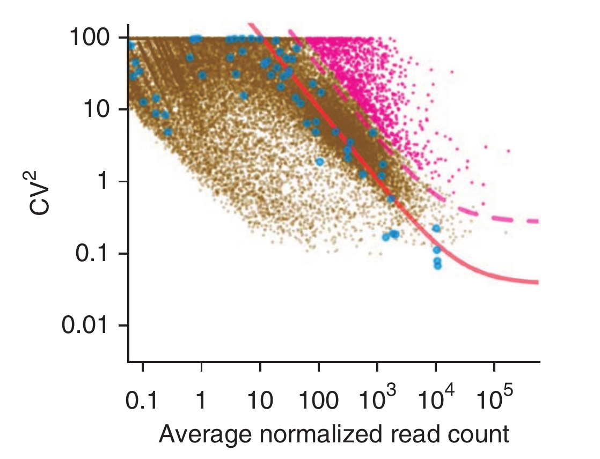
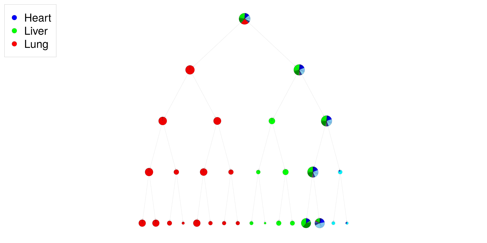

#Introduction 

By developing single cell technologies, determining cell populations in the datasets is a challenging problem. Finding highly variable genes helps us to have more power in detecting cell types. In this report, we are going to explore single cell technologies, their procedures and problems, and deeply look at highly variable gene finding methods. In this way, we first describe the dataset that we are using and then, two families of technologies. Then we look at previous methods and new methods proposed by us. The objective of new methods is to select genes without respect to their average expression among cells, that is one of the problem of prominently-used method. We define a parameter to compare genes variability. As a matter of fact, this parameter could be used in comparing variability in different cell types. Moreover, we try to use our parameter to find differentially expressed genes, in a situation that our data consists of only two groups, and we compare the genes that are selected between two methods of highly variable genes finding and differentially expression genes. One of the main objectives of this project is to build a tree to explain the heteregeneity structure that is inherent in the data. This could help us to find the structure of the data in terms of cell types.    

# What are highly-variable genes?

Having  a single cell RNA-seq data, we may need to explain heterogeneity inherent in the dataset. In dataset that all of the genes are present, signal to noise ratio is low and may cause problems in downstream analysis. So we must find gene's that are biologically variable and strongly contribute in cell-to-cell variation. 

# Dataset
In this work we are using a dataset containing single cell transcriptome data from mouse named "tabula-murris"[@tabula2018single]. It contains data from two different technologies. One of them is FACS-based full length transcript analysis with smart-seq2 and the other is Microfluidic droplet-based 3’-end counting. In the following sections, I'll describe their procedure and noises introduced in their pipeline.


## Smart-seq
First, they try to sort the cells with Fluorescence-Activated Cell Sorting(FACS). This step can have its own problem like separating the cells completely is not always possible and we may may have two cells in the next step. After sorting the cells, each cell goes into a well and it is sequenced using Smart-seq. Smart-seq is a high-throughput sequencing technology and has similar noises to the other technologies like total mRNA content, RT and capture rate, amplification noise, and sequencing depth. These noises are back-to-back and are spread out through the workflow. 
![Smart-seq pipeline[@wikisc]](./Pictures/Smart-seq2 workflow.png)

## Drop-seq
This technology is somehow new and different from others. As mRNAs are small and hard to detect, they are amplified to strengthen the signal and make it detectable. This can cause some mRNAs to be amplified more or less. This is the concept of amplification noise. UMI(unique mollecular identifiers) are like IDs to count each mRNA once. Actually, UMIs are counted. Moreover, with 3'-end counting, we have one fragment of each UMI and sequencing depth error is removed. Although it has its own errors. Barcoded primer beads have three parts that first of them is PCR handle. The other one is an ID for each cell. As we expect to have one bead and one cell in each droplet, this cell barcode is the same all over the bead. UMIs are used to distinguish between mRNAs[@macosko2015highly].

Like there maybe not enough UMIs for mRNAs. The pipeline is depicted in the following picture.


Experimentally, it is found that around %60 of UMIs have mRNA. But this barcoding can help us to distinguish between mRNAs and which cell they belong to. 

## Comparison between Smart-seq and Drop-seq
As mentioned above, noise amplification factor is removed with UMIs. But Smart-seq is full-length transcript and can count isoforms of a gene. Also in terms of number of genes detected, it outperforms as shown in the following plot[@ziegenhain2017comparative]. So both of them are popular.


#Setup
There are some libraries that are listed below and are used in this project. Besides, there are two R files that contain some functions that are used in this project. They are not included in this file to avoid function implementations and focus on functionality. 
```{r , message = F}
library(dplyr)
library(ggplot2)
library(gridExtra)
library(readr , warn.conflicts = F , quietly = T)
library(DESeq2 , warn.conflicts = F , quietly = T)
library(destiny)
library(data.tree)
library(igraph)
library(gridExtra)
library(visNetwork)
library(statmod)
library(purrr)
library(Rtsne)

source("./Src/Utility_Clustering.R")
source("./Src/Utility.R")

options(readr.num_columns = 0)
```

# Methods
In this section, methods and models that are used now and ours is described. Also there were some unsuccessful attempts that are explained in this report. Below we show three families of models and normalization  method for finding HVGs. 

## Previous methods
Negative binomial is the prominent methods used to find HVGs. In this model, a quadratic relationship between variance and mean is assumed[@brennecke2013accounting]:
$$\hat{variance} = \hat{mean} + \alpha \times \hat{mean}^2$$
Finally, they use the dispersion parameter to define variability. 

The problem here is dispersion parameter is not flat with respect to mean. This means that low-expressed genes cannot be selected as highly-variable. Even though low-expressed genes could be HV! So our motivation could be finding a flat parameter so that each gene, whichever its overall expression is, has equal change to be selected as HVG.

## Normalization
As mentioned above, there are noised that are sequentially introduced. Its really hard to interpret each steps noise and deconvolve to reach the main signal. But there is an interpretable noise. Total mRNA content is related to the cell size. The bigger the cell is, the higher amount of mRNA it can include. This can be measured with sum of squares of counts. So the cells can be normalized due to cell size and each cell can be divided with their cell size factor. The cell size factor is as follows:
$$CellSizeFactor_j = \sqrt{\Sigma_i k_{ji}}$$
Which $k_{ji}$ is the count of $gene_i$ in $cell_j$. After division, matrix elements would be small and we magnify it with average of size factors to make it more similar to the original one:
$$average(CellSizeFactors)$$
So lets see the differences in cell sizes in real data. I want to load data from a dataset that contains 100 cells sampled from Bladder cells in bladder tissue and 100 Bcells in spleen tissue.
In the following plot, you can see that Bladder cells overally have higher mRNA content that Bcells in UMIs:
```{r}
dropSeqBladder <- read.table(file = "./Data/Dropseq_3M9_Bladder_Bladder.csv" , sep = ",")
dropSeqBcell <- read.table(file = "./Data/Dropseq_3M8_Spleen_Bcell.csv" , sep = ",")
dropSeqBladder$X1 <- rownames(dropSeqBladder)
dropSeqBcell$X1 <- rownames(dropSeqBcell)
droplet.sampledDataset <- dropSeqBladder %>% full_join(dropSeqBcell , by = "X1")
rownames(droplet.sampledDataset) <- droplet.sampledDataset$X1
droplet.sampledDataset <- droplet.sampledDataset %>% select(-c(X1))
droplet.cellTypes <- c(rep("Bladder" , 100) , rep("Bcell" , 100))

iData <- droplet.sampledDataset
iData <- iData^2
iData %>% 
  colSums(na.rm = T) %>% 
  sqrt() -> sampleSum
ggplot(data.frame(cellSizes = sampleSum , group = factor(droplet.cellTypes))) + 
  geom_histogram(aes(x = log(cellSizes) , fill = group) , position = "dodge" , binwidth = 0.1)
```
We normalize it with L2 Normalization and put it in another object. Also we can remove genes(rows) that are zero across all cells:
```{r}
source("./Src/Utility.R")
tmpRowSum <- rowSums(droplet.sampledDataset)
droplet.sampledDataset <- droplet.sampledDataset[(tmpRowSum != 0),]
droplet.sampledDataset.l2sqrNormalized <- NormalizeL2Sqr(droplet.sampledDataset)
droplet.sampledDataset.l2Normalized <- NormalizeL2(droplet.sampledDataset)
```
We found out that L2 normalization is adequtive for drop-seq dataset, and we can use L2Square for smart-seq dataset to have flat parameters. Lets read smart-seq dataset and normalize it:
```{r}
smartseqBladder <- read.table(file = "./Data/FACS_3M8_bladder_bladder.csv" , sep = ",")
smartseqBcell <- read.table(file = "./Data/FACS_3M8_spleen_Bcell.csv" , sep = ",")
smartseqBladder$X1 <- rownames(smartseqBladder)
smartseqBcell$X1 <- rownames(smartseqBcell)
facs.sampledDataset <- smartseqBladder %>% full_join(smartseqBcell , by = "X1")
rownames(facs.sampledDataset) <- facs.sampledDataset$X1
facs.sampledDataset <- facs.sampledDataset %>% select(-c(X1))
facs.cellTypes <- c(rep("Bladder" , 100) , rep("Bcell" , 100))


# Removing genes that are zero in all samples
tmpRowSum <- rowSums(facs.sampledDataset)
facs.sampledDataset <- facs.sampledDataset[tmpRowSum != 0 ,]
facs.sampledDataset.l2sqrNormalized <- NormalizeL2SqrErcc(facs.sampledDataset)
facs.sampledDataset.l2Normalized <- NormalizeL2(facs.sampledDataset)
```

## Zero-inflated count data
Most of the counts in scRNA-seq dataset are zero:
```{r}
sum(droplet.sampledDataset == 0) / (ncol(droplet.sampledDataset) * nrow(droplet.sampledDataset))
```
So around %82 of the counts are zero, after removing genes that are zero across all samples (we did this work at first). This could be because of dropouts or etc. This makes counts distribution for each gene, a bimodal distribution. There are some reports like [@Valentine] that mention rely on variance to mean plots to show that count data is not zero-inflated. But we think that this is not enough to explain a distribution and genes could have bimodal distributions with a two peaks, one on zero and the other on another count more than zero, and negative binomial or poisson model is not able to explain that. We can check this property by looking at counts distribution for random genes. To do this, we can separate the tissues to remove this effect and directly look at counts in each specific tissue:
```{r}
idx <- sample(x = 1:nrow(droplet.sampledDataset) , size = 16 , replace = F)
droplet.selected <- droplet.sampledDataset[idx,]
p <- list()

for(i in 1:16){
  tmpDf <- data.frame(x1 = c(t(droplet.sampledDataset[i,1:100]) ,t(droplet.sampledDataset[i,101:200])) , cellTye = c(rep("Bladder" , 100) , rep("Bcell" , 100)))
  p[[i]] <- ggplot(data = tmpDf , aes(x = cellTye , y = x1)) + geom_violin(aes(fill = cellTye)) + 
    theme(legend.position = "none" ,axis.title.y=element_blank(), axis.title.x = element_blank())  
}
grid.arrange(grobs = p , nrow = 4 , ncol = 4)
```
As we can see, for most of the genes, there is a peak on zero. This pushes us to check for zero inflated models. In this way, we try to treat with zero counts and the non-zero counts in a different way.

## Negative binomial without zeros
We can remove zeros in each gene's vector across samples and look at the distribution of counts to check for negative binomial. The point is that we find a flat parameter:
```{r}
droplet.NBWithoutZeros <- HVG_NBOmmitZeros(droplet.sampledDataset.l2Normalized)
droplet.NBWithoutZeros[[1]]
```
So its not flat. Let's look at similar results for smart-seq. In smart-seq, as we have ERCC spike-ins in this dataset, we look at their disribution to check flatness:
```{r}
facs.NBWithoutZeros <- HVG_NBOmmitZeros(facs.sampledDataset.l2sqrNormalized)
p <- flatnessPlotWithErcc(facs.NBWithoutZeros[[2]] , "")
p
```
This is also not satisfiable. So it seems that with negative binomial, we couln't find a flat parameter.

## Residual
We wanted to find a flat parameter to define variability. One of the models that we can use is linear model. We can use linear regression to regress variance to mean, and use residuals of this linear regression as a parameter of variability. As a matter of fact, we use logarithm of those two parameters and our linear regression is as follows:
$$\log{variance} \sim \log{mean}$$
We can see this model's performance in the following plots:
```{r}
droplet.residuals <- HVG_residual(droplet.sampledDataset.l2Normalized)
genesInfo <- droplet.residuals[[2]]
p1 <- ggplot(genesInfo , aes(x = logMeans , y = logVars)) + 
  geom_point(alpha = 0.05) + geom_smooth(formula = y~x , method = "lm" , color = "red")
p1
```

Let's see the flatness plots for drop-seq:
```{r}
p2 <- droplet.residuals[[1]] + ggtitle("")
p2
```

For checking the flatness, we can look at rank of gene's average. In terms of flatness, wherever a gene lies in this ranking, should have equal chance to be highly-variable. So we can look at the ranks to check for flatness:
```{r}
genesInfo <- droplet.residuals[[2]]
genesInfo$meanRank <- order(genesInfo$means)
ggplot(genesInfo,aes(x = meanRank , y = resids)) + 
  geom_point(alpha = 0.2) + 
  xlab("Rank of gene's average across all of the genes") + ylab("Residual from regression line") + 
  geom_smooth(formula = y~x , method = "lm")
```

There is a little downward trend in the plot. Also we saw that with having few samples, this downward trend is more obvious. For smart-seq, we can look at linear model's performance:
```{r}
facs.residuals <- HVG_residual(facs.sampledDataset.l2sqrNormalized)
genesInfo <- facs.residuals[[2]]
p3 <- ggplot(genesInfo , aes(x = logMeans , y = logVars)) + 
  geom_point(alpha = 0.05) + geom_smooth(formula = y~x , color = "red" , method = "lm")
p3
```
As a matter of fact, linear model worked better for droplet data while in smart-seq we have more variation from regression line. We can look at their slopes and find that for drop-seq, it is near 1, while in smartseq, it could be 1.1 . Now let's check flatness:
```{r}
colnames(genesInfo)[6] <- "logAlpha"
p4 <- flatnessPlotWithErcc(genesInfo , "") + ylab("Residual from regression line")
p4
```
What about ranks in smart-seq?
```{r}
genesInfo$meanRank <- order(genesInfo$means)
ggplot(genesInfo , aes(x = meanRank , y = logAlpha)) + 
  geom_point(alpha = 0.05) + geom_smooth(formula = y~x , method = "lm" , color = "red") + 
  xlab("Rank of gene's average across all of the genes")
```

To put above information in a nutshell:
```{r}
grid.arrange(p1 , p2 , p3 , p4 , nrow = 2 , ncol = 2)
```

## Poisson
In poisson distribution, variance and mean of the random variable are equal. As we can use standard deviation and average, we can use Relative Variance(RV) to measure variability(from now on, we name it alpha):
$$\alpha = RV = \frac{variance}{mean}$$
Let's look at flatness plot for drop-seq:
```{r}
droplet.poisson <- HVG_Poisson(droplet.sampledDataset.l2Normalized)
droplet.poisson[[1]]
```
If we want to look at the ranks:
```{r}
genesInfo <- droplet.poisson[[2]]
genesInfo$meanRank <- order(genesInfo$means)
ggplot(genesInfo , aes(x = meanRank , y = logAlpha)) + 
  geom_point(alpha = 0.1) + 
  geom_smooth(formula = y~x , method = "lm" , color = "red") + 
  xlab("Rank of gene's average")
```
we're satisfied with this flatness. Let's look at smart-seq:
```{r}
facs.poisson <- HVG_Poisson(facs.sampledDataset.l2sqrNormalized)
p <- flatnessPlotWithErcc(facs.poisson[[2]] , "")
```
And ranks:
```{r}
genesInfo <- facs.poisson[[2]]
genesInfo$meanRank <- order(genesInfo$means)
ggplot(genesInfo , aes(x = meanRank , y = logAlpha)) + 
  geom_point(alpha = 0.1) + geom_smooth(formula = y~x , method = "lm" , color = "red") + 
  xlab("Rank of gene's average")
```


## Poisson without zeros
Like the idea that we had in negative binomial, what if we remove the zeors and check for the poisson model?
```{r}
droplet.poissonWithoutZeros <- HVG_PoissonOmmitZeros(droplet.sampledDataset.l2Normalized)
droplet.poissonWithoutZeros[[1]]
```
Not flat.
In smart-seq:
```{r}
facs.poissonWithoutZeros <- HVG_PoissonOmmitZeros(facs.sampledDataset.l2sqrNormalized)
p <- flatnessPlotWithErcc(facs.poissonWithoutZeros[[2]] , "")
p
```
So we choose poisson model without ommiting the zeros. It will be a good comparison to check for alpha's calculated in two different technologies. As we mentioned, we've used l2 normalization for drop-seq and l2square for smart-seq. We can check for compatibility of alphas between two technologies:
```{r}
genesInfo1 <- droplet.poisson[[2]] %>% as.data.frame()
genesInfo2 <- facs.poisson[[2]] %>% as.data.frame()

# Should put same genes in the order
rownames(genesInfo1) <- as.character(genesInfo1$names)
genesInfo1 <- genesInfo1[as.character(genesInfo2$names),]
tmpDf <- data.frame(x = genesInfo1$logAlpha , y = genesInfo2$logAlpha)
kendallCor <- cor(tmpDf$x , tmpDf$y , method = "kendall" , use = "complete.obs")
ggplot(tmpDf , aes(x = x , y = y)) + 
  geom_point(alpha = 0.2) + geom_smooth(formula = y~x ,method = "lm" , color= "red") + 
  annotate(x = 0 , y = 4 , geom = "text" , label = paste("Kendall correlation =" , kendallCor) , size= 5) + 
  xlab("RV calculated from L2 normalized drop-seq") + ylab("RV calculated from L2Square normalized smart-seq")
```
What if we compare alpha from both l2squared datasets?
```{r}
genesInfo1 <- HVG_Poisson(droplet.sampledDataset.l2sqrNormalized)[[2]] %>% as.data.frame()
genesInfo2 <- facs.poisson[[2]] %>% as.data.frame()

rownames(genesInfo1) <- as.character(genesInfo1$names)
genesInfo1 <- genesInfo1[as.character(genesInfo2$names),]
tmpDf <- data.frame(x = genesInfo1$logAlpha , y = genesInfo2$logAlpha)
kendallCor <- cor(tmpDf$x , tmpDf$y , method = "kendall" , use = "complete.obs")
ggplot(tmpDf , aes(x = x , y = y)) + 
  geom_point(alpha = 0.2) + geom_smooth(formula = y~x ,method = "lm" , color= "red") + 
  annotate(x = 0 , y = 4 , geom = "text" , label = paste("Kendall correlation =" , kendallCor) , size= 5) + 
  xlab("RV calculated from L2Square normalized drop-seq") + ylab("RV calculated from L2Square normalized smart-seq")
```
Satisfactory result here could be a nice correlation near to one! But it seems that there are more works to do maybe in smart-seq.
### How to extract HVG from poisson model
So far we talked about models but how to find and extract highly-variable genes from this models? One way is to put a threshold on variability parameter(alpha) and select genes that have higher variability parameter thatn usual. Like this:
```{r}
tmp <- droplet.poisson[[2]]
p <- ggplot(tmp) + 
  geom_point(aes(x = logMeans , y = logAlpha) , alpha = 0.05) + 
  xlab("Logarithm of gene's average") + ylab("Logarithm of alpha (RV)")
p + geom_hline(yintercept = 1 , linetype = "dashed" , size = 3 , color = "red")
```
The other idea comes from modeling poisson. For each gene, we assume having a poisson distribution with their average as their poisson parameter. Then we sample from that poisson distribution in the number of samples. Then we have a vector, and we calculate its alpha and plot it in our flatness plot. This would be as follows:
```{r}
sampleSize <- ncol(droplet.sampledDataset.l2Normalized)

poissSampsDf <- data.frame()
colCounter <- 1
geneMeans = rowMeans(droplet.sampledDataset.l2Normalized , na.rm = T)
for(i in geneMeans){
  tmpPoiss <- rpois(n = sampleSize , lambda = i)
  if(colCounter == 1){
    poissSampsDf <- data.frame(tmpPoiss)
  } else{
    poissSampsDf <- cbind(poissSampsDf , data.frame(tmpPoiss))
  }
  colCounter <- colCounter + 1
}
colnames(poissSampsDf) <- paste0("Gene" , 1:ncol(poissSampsDf))
rownames(poissSampsDf) <- paste0("Sample" , 1:nrow(poissSampsDf))
poissSampsDf <- t(poissSampsDf) 
poissSampsDf.l2normalized <- NormalizeL2(poissSampsDf)
  
counter <- 1
varToMean <- 0
estimatedMeans <- 0
for(i in 1:nrow(poissSampsDf.l2normalized)){
  poissSamps <- as.numeric(poissSampsDf.l2normalized[i,])
  tmpMean <- mean(poissSamps , na.rm = T)
  tmpVar <- var(poissSamps , na.rm = T)
  varToMean[counter] <- tmpVar / tmpMean
  estimatedMeans[counter] <- tmpMean
  counter <- counter + 1
}
tmpDf <- data.frame(x = log(estimatedMeans) , y = log(varToMean))
tmpDf$group <- rep("Simulated" , nrow(tmpDf))
tmpDf <- rbind(tmpDf , data.frame(x = genesInfo$logMeans , y = genesInfo$logAlpha , group = rep("Real" , nrow(genesInfo))))
tmpDf$group <- factor(tmpDf$group)
p <- ggplot(data = tmpDf) + 
  geom_point(aes(x = x , y = y, color = group) , alpha = 0.05)  + 
  ylim(c(-1.1 , 3)) + xlab("Logarithm of gene's expression average") + ylab("Logarithm of Gene's alpha(RV)") + 
  guides(colour = guide_legend(override.aes = list(alpha=1)))
p
```
It would be nice if we find an envelope for these simulated points and put a threshold for genes that are higher than this envelope to find highly-variable genes. We haven't done this part yet. 

# Checking variability in cell types
One of the uses of the variability parameter, is to compare variability in cell types. For example we can look for more variable cell states during developement. The other example is aging. As you may know, aging is the progressive loss of physiological and cellular functions, and immune system will be less effective with aging. There is a study of young and old mice that shows early immune activation is conserved and tightly regulated in young mice, but as mice get older, early immune activation is not that robust and is variable between cells[@martinez2017aging].


So we may define cell-to-cell transcriptional variability as a hallmark for aging. Here, we will check the genes variability and compare it between young and old mice. This can give us the sign for cell-to-cell variability.
```{r}
normalized.data <- read.table("./Data/mouseAging/normalized_data.txt" , header = T)
metaData <- readxl::read_xlsx("./Data/mouseAging/metadata.xlsx")

dat <- normalized.data[rownames(normalized.data) , colnames(normalized.data)]
metaData <- as.data.frame(metaData)
rownames(metaData) <- metaData$CellName
metaData <- metaData[colnames(dat),]
cellType <- metaData$Age
cells.young <- metaData[which(metaData$Age == "Young") , "CellName"]
dat.young <- normalized.data[,cells.young]
cells.old <- metaData[which(metaData$Age == "Old") , "CellName"]
dat.old <- normalized.data[,cells.old]

# smart-seq
dat.young.normalized <- NormalizeL2(dat.young)
dat.old.normalized <- NormalizeL2(dat.old)

poiss.young <- HVG_Poisson(dat.young.normalized)
poiss.old <- HVG_Poisson(dat.old.normalized)
p1 <- ggplot(data = poiss.young[[2]] , aes(x = logMeans , y = logAlpha)) + 
  geom_point(alpha = 0.05) + 
  xlab("Logarithm of gene's average") + ylab("Logarithm of alpha(RV)")
p2 <- ggplot(data = poiss.old[[2]] , aes(x = logMeans , y = logAlpha)) + 
  geom_point(alpha = 0.05) + 
  xlab("Logarithm of gene's average") + ylab("Logarithm of alpha(RV)")

p1 <- p1 + xlim(c(-7 , 20)) + ylim(c(2.5 , 13)) + ggtitle("Young mice") + 
  geom_abline(aes(slope = 0 , intercept = 10.5) , linetype = 2 , color = "red" , size = 2)
p2 <- p2 + xlim(c(-7 , 20)) + ylim(c(2.5 , 13)) + ggtitle("Old mice") + 
  geom_abline(aes(slope = 0 , intercept = 10.5) , linetype = 2 , color = "red" , size = 2)
gridExtra::grid.arrange(p1 , p2 , ncol = 2)
```
As we can see, the genes variability in old mice is higher than the young mice. Thus, our results are compatible with the fact that cell-to-cell variability increases with aging.      
Moreover, we want to compare the variability in cell states while differentiation. We will use two datasets to check the variability of cell states, one of them in non-UMI based and the other is UMI based. In these dataset, we'll compare the plots of flatness, and check if any increasing trend exists during cell differentitation. The fist dataset has three cell states. First one is the state that cells have Leukemia Inhibitory Factor(LIF). When LIF is removed, the cells start to differentiate and genes that are responsible for cell cycle are more variable. The other states are "2i" and "a2i" that are ground states[@kolodziejczyk2015single]. Lets look at the results:

```{r}
## 2i
sampledDataset <- read_csv(file = "./Data/Cell States/nonUMI-based/dataset-2i.csv" , col_names = T)
sampledDataset <- as.data.frame(sampledDataset)
rownames(sampledDataset) <- sampledDataset$X1
sampledDataset %>% 
  select(-X1) -> sampledDataset
tmpRowSum <- rowSums(sampledDataset)
sampledDataset <- sampledDataset[(tmpRowSum != 0) , ]
i2.sampledDatasetL2SqrNormalized <- NormalizeL2Sqr(sampledDataset)

i2.poissModel.l2Sqr <- HVG_Poisson(i2.sampledDatasetL2SqrNormalized)
genesInfo <- i2.poissModel.l2Sqr[[2]]
p <- ggplot(genesInfo) + 
  geom_point(aes(x = logMeans , y = logAlpha) , alpha = 0.05)
L2SqrI2Plot <- p

## a2i
sampledDataset <- read_csv(file = "./Data/Cell States/nonUMI-based/dataset-a2i.csv" , col_names = T)
sampledDataset <- as.data.frame(sampledDataset)
rownames(sampledDataset) <- sampledDataset$X1
sampledDataset %>% 
  select(-X1) -> sampledDataset
tmpRowSum <- rowSums(sampledDataset)
sampledDataset <- sampledDataset[(tmpRowSum != 0) , ]
ai2.sampledDatasetL2SqrNormalized <- NormalizeL2Sqr(sampledDataset)

ai2.poissModel.l2Sqr <- HVG_Poisson(ai2.sampledDatasetL2SqrNormalized)
genesInfo <- ai2.poissModel.l2Sqr[[2]]
p <- ggplot(genesInfo) + 
  geom_point(aes(x = logMeans , y = logAlpha) , alpha = 0.05)
L2SqrA2IPlot <- p

## LIF
sampledDataset <- read_csv(file = "./Data/Cell States/nonUMI-based/dataset-lif.csv" , col_names = T)
sampledDataset <- as.data.frame(sampledDataset)
rownames(sampledDataset) <- sampledDataset$X1
sampledDataset %>% 
  select(-X1) -> sampledDataset
tmpRowSum <- rowSums(sampledDataset)
sampledDataset <- sampledDataset[(tmpRowSum != 0) , ]
lif.sampledDatasetL2SqrNormalized <- NormalizeL2Sqr(sampledDataset)

lif.poissModel.l2Sqr <- HVG_Poisson(lif.sampledDatasetL2SqrNormalized)
genesInfo <- lif.poissModel.l2Sqr[[2]]
p <- ggplot(genesInfo) + 
  geom_point(aes(x = logMeans , y = logAlpha) , alpha = 0.05)
L2SqrLIFPlot <- p

p1 <- L2SqrA2IPlot + ggtitle("a2i") + 
  geom_abline(aes(slope = 0 , intercept = 2) , linetype = 2 , color = "red" , size = 2) + 
  xlim(c(-7 , 10)) + ylim(-3 , 4)
p2 <- L2SqrLIFPlot + ggtitle("lif") + 
  geom_abline(aes(slope = 0 , intercept = 2) , linetype = 2 , color = "red" , size = 2) + 
  xlim(c(-7 , 10)) + ylim(-3 , 4)
p3 <- L2SqrI2Plot + ggtitle("2i") + 
  geom_abline(aes(slope = 0 , intercept = 2) , linetype = 2 , color = "red" , size = 2) + 
  xlim(c(-7 , 10)) + ylim(-3 , 4)

grid.arrange(p2 , p3 , p1 , ncol = 3)
```
We can see that from left to right, there is an increasing in the trend of alpha for genes, meaning that more genes are variable in a2i than lif. "a2i" is the alternative ground state but our results show that this is more variable than "2i".    
Another dataset that we worked on is "GSE65525"[@klein2015droplet]. In this dataset, we've selected two states. First one is the main state, but the other one is the state that LIF is removed 7 days before. So we expect that the "minus lif" state is more variable than the main state. As mentioned above, this dataset is UMI-based and we use L2 normalization for that (I sampled 200 cells from each data):
```{r}
dat <- read.csv("./Data/Cell States/UMI-based/GSM1599499_ES_d7_LIFminus.csv" , header = F)
dat <- as.data.frame(dat)
rownames(dat) <- dat$V1
mesc.sampledDataset <- dat
mesc.sampledDataset <- mesc.sampledDataset %>% select(-c(V1))

mesc.lif.l2Normalized <- NormalizeL2(mesc.sampledDataset)

mesc.lif.poissModelL2 <- HVG_Poisson(mesc.lif.l2Normalized)
genesInfo <- mesc.lif.poissModelL2[[2]]
p <- ggplot(genesInfo , aes(x = logMeans , y = logAlpha)) + 
  geom_point(alpha = 0.05)
L2LIFPlot <- p + ggtitle("L2 Normalization")

dat <- read.csv("./Data/Cell States/UMI-based/GSM1599494_ES_d0_main.csv" , header = F)
dat <- as.data.frame(dat)
rownames(dat) <- dat$V1
mesc.sampledDataset <- dat
mesc.sampledDataset <- mesc.sampledDataset %>% select(-c(V1))
mesc.main.l2Normalized <- NormalizeL2(mesc.sampledDataset)

mesc.main.poissModelL2 <- HVG_Poisson(mesc.main.l2Normalized)
genesInfo <- mesc.main.poissModelL2[[2]]
p <- ggplot(genesInfo , aes(x = logMeans , y = logAlpha)) + 
  geom_point(alpha = 0.05)
L2MESCFPlot <- p + ggtitle("L2 Normalization")

p1 <- L2LIFPlot + ggtitle("LIF minus") + 
  geom_abline(aes(slope = 0 , intercept = 0.5) , color = "red" , linetype = 2 , size = 2) + 
  xlim(c(-11 , 7.5)) + ylim(c(-1 , 4))
p2 <- L2MESCFPlot + ggtitle("main mESC") + 
  geom_abline(aes(slope = 0 , intercept = 0.5) , color = "red" , linetype = 2 , size = 2) + 
  xlim(c(-11 , 7.5)) + ylim(c(-1 , 4))
grid.arrange(p2 , p1 , ncol = 2)
```
So the results are satisfiable and we see an increasing trend in 7 days after removing LIF.

# Comparison with differential expression analysis
In specific setting that we have two groups, we can find differentially expressed genes. The hypothesis is that we see a relative agreement between differentially expressed genes and highly-variable genes. Althought some genes could be highly variable in just bladder tissues and DE won't select them. Moreover, we can compare genes selected with our method (with a threshold for alpha) with brennecke selected genes. We'll set the threshold as the two methods are compatible in number with differential gene expression to make it more meaningful.     
We should point out that these comparison could not be the best case. Because using DESEQ2 for single cell DE could cause problems. DE is approach for having few samples. Also scRNA-seq dataset is zero-inflated and it may cause problems in DESEQ wokflow (like in the normalization part). Note that we're using "M3Drop" package for finding HVG with Brennecke method:
```{r}
## DE
columnData <- data.frame(condition = droplet.cellTypes)
rownames(columnData) <- colnames(droplet.sampledDataset)
columnData$condition <- droplet.cellTypes
columnData$condition <- as.factor(columnData$condition)
droplet.dds <- DESeqDataSetFromMatrix(countData = droplet.sampledDataset,
                                   colData = columnData,
                                   design = ~ condition)
droplet.dds <- DESeq(droplet.dds)
res <- results(droplet.dds, name="condition_Bladder_vs_Bcell")
resOrdered <- res[order(res$pvalue , decreasing = F),]
resSig <- subset(resOrdered , padj < 0.01)
dim(resSig)
diffExp.genes <- as.character(rownames(resSig))

## Brennecke
hvgBrennecke.droplet <- M3Drop::BrenneckeGetVariableGenes(expr_mat = droplet.sampledDataset , spikes = c() , fdr = 0.8 , suppress.plot = T)
# The reason that I chose 0.8, is to enlarge the size of selected gene's set. It is also weird that we should choose 0.8 as our p-value threshold 
hvgBrennecke.droplet <- hvgBrennecke.droplet$Gene
length(hvgBrennecke.droplet)

## Poisson 
droplet.poissonModelL2 <- HVG_Poisson(droplet.sampledDataset.l2Normalized)
genesInfo <- droplet.poissonModelL2[[2]]

genesInfo %>% group_by(names) %>% 
  mutate(isAboveThreshold = ifelse(logAlpha > 1.1 , 1 , 0)) -> genesInfo
tmp <- genesInfo %>% filter(isAboveThreshold == 1)
droplet.PoissModel.hvg <- as.character(tmp$names)
length(droplet.PoissModel.hvg)
# We chose 1.1  to have around 3k genes

# comparison
VennDiagram::venn.diagram(x = list(DifferentialExpression = diffExp.genes , BrenneckeHVG = hvgBrennecke.droplet , PoissonHVG = droplet.PoissModel.hvg) , filename = "./Pictures/compareDifferentGeneSelectionMethods" , imagetype = "png" , main = "Compare genes selected in two methods for drop-seq data \n Brennecke threshold = 0.8 , DE threshold = 0.01 ,  Poisson threshold = 1.1" , height = 5000 , width = 5500)
```

Actually, I draw more beautiful plot with an online software:

So we can see that poisson model results are more similar to differential expression analysis results. So we could be content with this result!

# Heterogeneity decision tree
One of the interesting motivations of this project, is to build a heterogeneity decision tree. Consider having a huge dataset of scRNA-seq and you want to find cell populations inherent in your data. With one set of HVG, we cannot find all cell populations inside the data. Also small cell populations could hide inside bigger ones. So we propose a way to overcome these problems.    
The idea is that we find a set of HVG. Then we cluster the sample space with HVGs into two parts. Then we have two clusters. We can continue this procedure recursively and build a tree. We'll stop clustering if we cannot find two cell populations. This can be done with a hypothesis test.     
Currently, we're using normalized cut to cluster the sample space in a way that we plot the diffusion map of our dataset. Then we split the samples into two parts that in the first part we have samples that their first Diffusion Component (DC1) is below zero and the rest in the other cluster. If there are few samples in each cluster, we'll stop our recursion from that cluster and continue with the other one. For example, consider having 4 samples that their DC1 is below zero, but 20 samples that their DC1 is equal or greater than zero. So we finish clustering for the first node and continue it for the other. Other methods are going to be tested in further parts of the project and we'll use hypothesis test to check if we have two clusters. Currently, we stop our clustering if we have fewer than four samples. 
This workflow is depicted in the following picture:


A full log of results of flatness for each node, is outputted. Also the structure of the tree is in the output. The main output is a hierarchical pie chart, that each node shows each nodes cell types and their relative population. Pie size is relative to number of samples that we have at each state.    
We'll use this workflow on a dataset containing samples from three tissues, heart, liver, and lung. I want to mention that ontologies are colored the same as their cell type. For example if liver has two cell types, both of them have same color like one of them is "red2" and the other is "red3" :

```{r}
dat <- read.table("./Data/Clustering Dataset/Counts.csv" , sep= ",")
cellTypesDf <- read.table("./Data/Clustering Dataset/cellTypes.csv" , sep = ",")

rownames(dat) <- dat$X1
dat <- dat %>% select(-c(X1))
dat.normalized <- NormalizeL2Sqr(dat)

tmpRowSum <- rowSums(as.matrix(dat.normalized))
dat.normalized <- dat.normalized[(tmpRowSum != 0) , ]

tmpColSum <- colSums(as.matrix(dat.normalized))
dat.normalized <- dat.normalized[,(tmpColSum != 0)]
cellTypesDf <- cellTypesDf[(tmpColSum != 0) , ]

myColors <- c("green" , "green1", "green2" , "green3" , "green4" , "springgreen", "red3" , "red2" , "royalblue" , "royalblue3" , "royalblue4" , "skyblue" , "skyblue1" , "skyblue2" , "skyblue3", "blue" , "blue1" , "blue2" , "blue3" , "blue4" , "turquoise1")

cellTypesDf$tissue <- as.character(cellTypesDf$tissue)
cellTypesDf$subTissues <- as.character(cellTypesDf$subTissues)
cellTypes <- cellTypesDf$subTissues
tmp <- data.frame(cellTypes = unique(cellTypes) , cols = myColors[1:length(unique(cellTypes))])
scaleColor <- as.character(tmp$cols)
names(scaleColor) <- as.character(tmp$cellTypes)

myColors2 <- c("blue" , "green" , "red")
tmp <- data.frame(cellTypes = as.character(c(unique(cellTypesDf$tissue))) , cols = myColors2)
colorTissue <- as.character(tmp$cols)
names(colorTissue) <- as.character(tmp$cellTypes)
```
First, its good to look at tSNE plot to get a general view of the dataset:
```{r}
tsRes <- Rtsne(X = t(as.matrix(dat.normalized)) , dims = 2 , perplexity = 50)
  
p <- visualizetSNEggPlot(tsneObj = tsRes , dims = 2 , cellTypes = cellTypes , sampNames = colnames(dat.normalized) ,
                      scaleColor = scaleColor , leg = F)
p
```

If someone uses tSNE to cluster this data, he/she would get lots of mislabeling. Status would be more complicated if you mix lots of cell types.     
Lets see how the clustering works. One can choose the threshold that is used in each step. Also the number of iterations, how deep the tree should be, could be more. In each step, number genes selected for each node is logged. You also can see if iterations is finished for a node:
```{r , message=F , warning=F, results='hide'}
iterations <- 4
parentNode <- 0
thresholdForNoSelectedGenes <- 0.15

resetGlobalVariables(iterations , cellTypes = cellTypes)
makeVertexLevelTable(iterations , parentNode , totIters = iterations)
binaryTreeStructure <- fullBinaryTreeStructure

resetGlobalVariables(iterations , cellTypes = cellTypes)
pdf("./ResultsOfClustering/HierarchicalClusteringDetails.pdf")
hvgCluster(dat.normalized , iterations = iterations , totIters = iterations , parNodeID = parentNode , 
           scaleColor = scaleColor , thresholdForNoSelectedGenes = thresholdForNoSelectedGenes)
dev.off()
```
The results are stored in global variables. So let's visualize the results :
```{r}
treeStructure %>% 
  mutate(edge = paste(parent , child)) -> tmp
edgeList <- tmp$edge
edgeList <- as.integer(unlist(strsplit(edgeList , split = "\\s+")))

if(edgeList[1] == 0){
  edgeList <- edgeList[-c(1 , 2)]
}

edgeList <- paste0("node" , edgeList)
finGraph <- make_graph(edges = edgeList , directed = T)
LO <- layout_as_tree(finGraph, root ="node1", flip.y=FALSE)
visIgraph(finGraph, layout='layout.norm', layoutMatrix=LO)
```


Above, you can see the general structure of the tree and the name of the nodes. You can search for more details in the resulted "pdf" with the name of the node.    

When we have the tree, we will assume that each leaf, is a specific sub-cell type. So we can find the accuracy as the number of true labelings in the leafs:
```{r}
leafs <- tmp[!(tmp$child %in% tmp$parent),]$child
pieDf[, "maxCounts"] <- apply(pieDf[,3:(length(unique(cellTypes)) + 2)], 1, max)
pieDf %>% 
  filter(index %in% leafs) -> tmp
print("The accuracry of the method is(across ontologies of tissues)")
sum(tmp$maxCounts) / ncol(dat.normalized)
```
Remember that with increasing the number of iterations, you will get more accurate results.  

Drawing the hierarchical pie chart:
```{r}
rownames(pieDf) <- pieDf$index
pieDf$index %>% map(function(i) as.integer(pieDf[as.character(i),3:(length(unique(cellTypes)) + 2)])) -> tmp
names(tmp) <- paste0("node",pieDf$index)

co <- layout.reingold.tilford(finGraph , params=list(root="node1" , flip.y = T))
png("./ResultsOfClustering/hierarchical piechart.png" , height = 3200 , width = 6400)
plot.igraph(finGraph, layout=co , vertex.shape="pie", vertex.pie=tmp, vertex.pie.color = list(scaleColor), vertex.size=log(pieDf$cellCount)*1.5 , vertex.label=NA , mark.expand = 30 , mark.shape = 1 , rescale =T , asp = 1 , 
            height = 3200 , width = 6400)
op <- par(cex = 12)
legend('topleft',legend=names(colorTissue),col='black',pch=21, pt.bg=colorTissue)
dev.off()
```


The accuracy that was calculate above is the accuracy in detecting sub-tissues. We can also find intra-tissue accuracy:
```{r}
HeartCells <- paste(colnames(pieDf[,3:8]))
LiverCells <- paste(colnames(pieDf[,9:10]))
LungCells <- paste(colnames(pieDf[,11:23]))

tmp <- pieDf
tmp <- tmp[,c(1 , 2)]
tmp$Heart <- rowSums(pieDf[,3:8])
tmp$Liver <- rowSums(pieDf[,9:10])
tmp$Lung <- rowSums(pieDf[,11:23])

tmp[, "maxCounts"] <- apply(tmp[,3:ncol(tmp)], 1, max)
tmp %>% 
  filter(index %in% leafs) -> tmp1
print("The accuracry of the method is (across tissue)")
sum(tmp1$maxCounts) / ncol(dat.normalized)
```
It is obvious that our accuracy among tissues would be higher. 

# Summary
To sum up, we criticized commonly-used method for HVG and suggested using:   
1- L2 normalization for UMI data   
2- L2 square normalization for smart-seq data    
and then use relative variance to find HVGs which its initial assumption for each gene is that its relative variance should be near to one. So we are assuming a poisson distribution for normalized counts.    
We have compared variability in cell types with the parameter. In differentially expression, we were more similar to DESeq2 in comparison to genes selected with brennecke method, although we urge a revision for differentially expression method for scRNA-seq data.    
To find the heterogeneity inherent in data, we have built a decision tree to find the sources of heterogeneity and detect small populations.    


# Session info {.unnumbered}

```{r sessionInfo, echo=FALSE}
sessionInfo()
```

# References